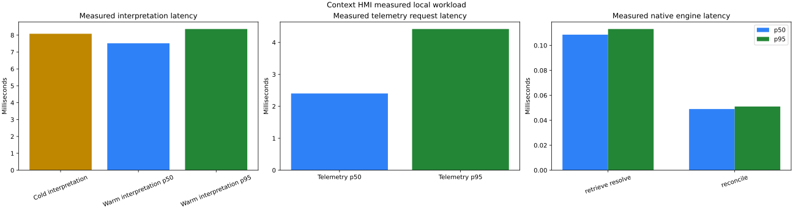

= Benchmark results

Status:: Measured local release evidence
Date:: 2026-09-11

Environment:: Linux 6.14.0-37, x86_64, glibc 2.39, GCC 13.3.0, CMake 4.3.2
Build:: `Release`, rules interpreter, external JSON telemetry ingestion

== Observed results

[cols="3,2,2",options="header"]
|===
|Path |p50 |p95
|Native context retrieval and task resolution |0.109 ms |0.113 ms
|Native revision reconciliation |0.049 ms |0.051 ms
|Warm HTTP interpretation with durable saved-task record |7.517 ms |8.363 ms
|Concurrent HTTP telemetry read |2.403 ms |4.420 ms
|===

The cold HTTP interpretation was 8.080 ms and HTTP reconciliation was 0.498 ms.
The live workload made 64 telemetry reads through 16 concurrent clients with zero
failures. Service resident memory was 14,483,456 bytes. The selected context was
1,992 serialized bytes, estimated as 498 tokens. After the cold request, all 80
repeated requests hit both bounded native caches; the caches reported no eviction or
expiration during this run.

The native report contains 1,400 samples per operation. The live report contains 80
warm interpretations and 64 telemetry reads. Exact source data is retained in
link:results/native-2026-09-11.json[native raw JSON] and
link:results/live-2026-09-11.json[live raw JSON]. The plot was rendered from those
files using Matplotlib 3.11.1 and `benchmarks/plot.py`.

== Limits

These are observations from a shared workstation, not real-time guarantees or a
product comparison. The run used the deterministic rules interpreter and an authored
request; it does not measure llama.cpp inference or held-out interpretation accuracy.
Target-device, native Windows, Linux Mint, TCL display, container, source-adapter and
vendor-runtime measurements require their named environments.
